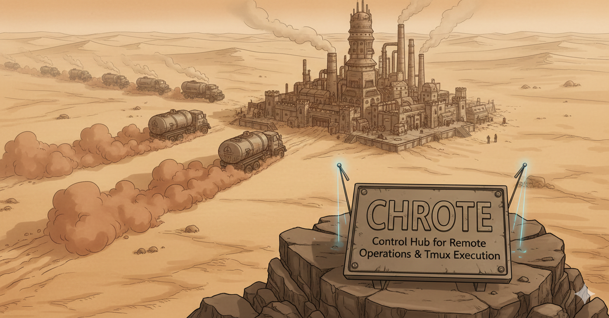
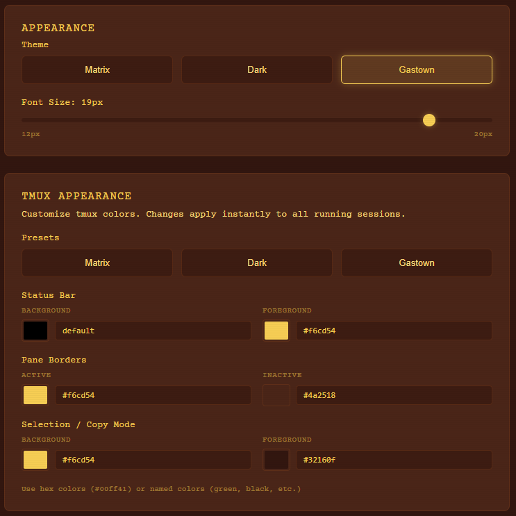
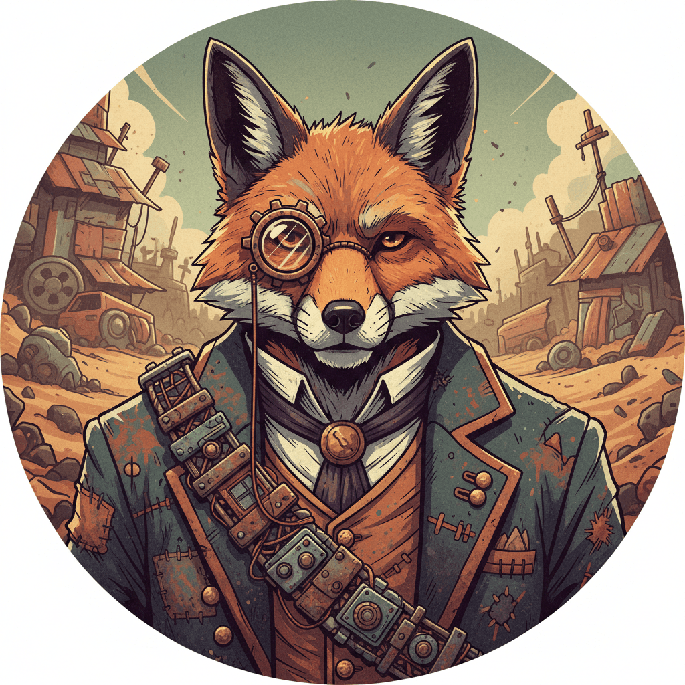
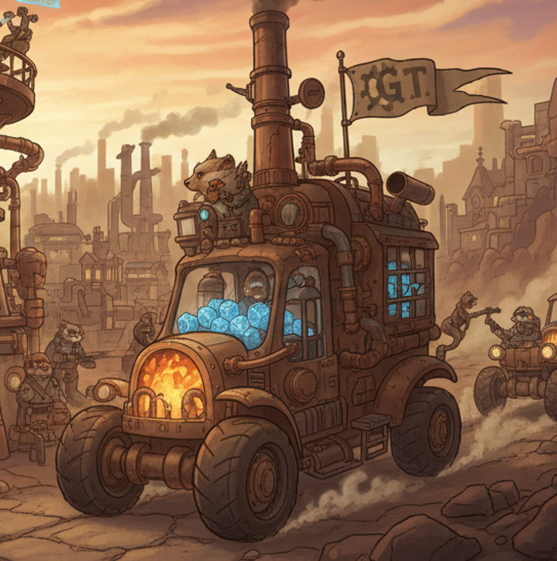
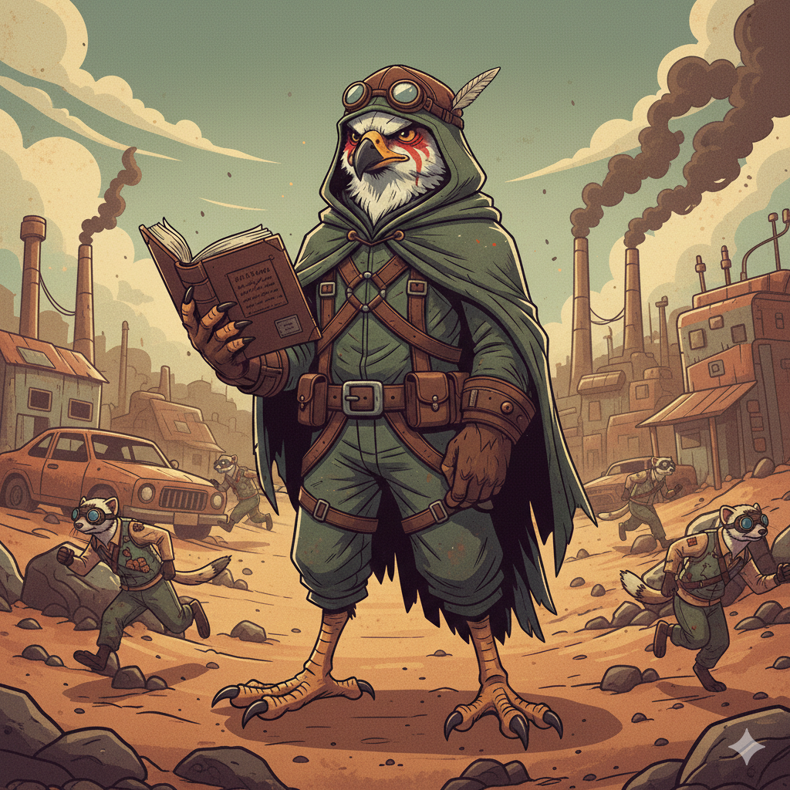

# CHROTE



**C**ontrol **H**ub for **R**emote **O**perations & **T**mux **E**xecution

---

> **WARNING:** This software was vibe-coded at 3am by mass hallucinations between a human and multiple AI agents. It works on my machine. It might work on yours. It probably won't. If it does, that's the miracle - not the expectation.

> **DANGER:** You are about to run code that spawns dozens of AI agents with terminal access. They will read your project files. They will write your project files. They will argue with each other. They will occasionally achieve something useful. Mostly they will burn through your API credits like a war rig burns guzzoline.

> **CAUTION:** If you have to ask "is this safe?" - turn back now. This is the wasteland. We don't do safe here. We do *fast*, *loud*, and *pray the tests pass*. I asked the three wise men of the West - Gemini, Claude, and ChatGPT - and they said it's fine. Maybe I should consult the three wise men of the East next.

---

## What Is This?

CHROTE is **your own personal tmux cloud** - a web dashboard that lets you run AI coding agent swarms from anywhere, on any device.

**The pitch:** You're out jogging, dictating code changes through voice (and keeping your phone open on a browser where you squint to make sense of anything and scroll is so hard it makes you weep... but you can still yell at the mayor, which covers 95% of the mobile experience youd want anyway. 

You close your laptop lid and the agents keep working. You open a different machine and pick up exactly where you left off. Your tmux sessions live in the cloud (your cloud, on your hardware), accessible via Tailscale from anywhere in the world.

**The experience:** Best of both worlds. You get the raw power of terminal interfaces - tmux, Claude Code, the command line. And you get a modern web dashboard on top - drag-and-drop session management, visual monitoring, theme customization, ambient music. Terminal purists and GUI lovers, united at last.

You know how normal people run one Claude Code instance and carefully review each change?

We don't do that here.

Here, we spin up 10, 20, 30 agents. We point them at problems. We watch the chaos unfold through terminal windows. Sometimes they solve the problem. Sometimes they fight each other. Sometimes they all independently decide to refactor the same file and create merge conflicts that would make God weep.

**It's beautiful.**


---

## Who Is This For?

**This is NOT for you if:**
- You've never used Claude Code
- You think "vibe coding" sounds irresponsible
- You have a budget
- You need things to work reliably
- You value your sanity

**This IS for you if:**
- You're already mass-prompting Claude Code instances in a dozen terminal tabs
- You've accepted that AI will write most of your code and you're just here to steer
- You understand that "it works on my machine" is a lifestyle
- You have more API credits than sense
- You want to feel like a mad scientist running a robot army

---

## Dashboard Features

### Terminal View
- 1-4 terminal panes per tab (two tabs = 8 total windows)
- Drag sessions from sidebar onto windows
- Click tabs to switch between assigned sessions
- Each empty window shows its guardian - placeholder artwork you get to look at for exactly three seconds before burying it under a tmux session. It's there. Then it's not. Like a wasteland Polaroid.


### Files and Themes

Access your project files directly through the dashboard with the native file browser:


Customize your workspace with multiple built-in themes:



### The Nuclear Option

See that "Nuke All Sessions" button?

It does exactly what it says. All sessions. Gone. Instantly.

Use it liberally. This is the wasteland. Attachment is weakness. If your agents are stuck in loops, arguing with themselves, or have collectively decided to rewrite your codebase in Haskell - nuke them. Start over. You'll feel better.

### Session Naming

| Prefix | Example | What It Means |
|--------|---------|---------------|
| `hq-` | `hq-mayor` | Headquarters - coordination sessions |
| `gt-rigname-` | `gt-gastown-jack` | Rig workers - the agents doing actual work |
| `main`, `shell` | `main` | Your personal sessions |
| Other | `chaos-monkey` | Whatever you want, we don't judge |

---

## The Crew

Every terminal window in CHROTE has a guardian - a wasteland operator watching over your agents. They don't actually *do* anything. They're just... there. Staring. Judging your tmux sessions with silent, pixel-based disapproval. Think of them as the dashboard's emotional support animals, except they're cyberpunk rodents who've seen some shit and have zero therapeutic credentials.

> **Fun fact:** 50% of CHROTE's development time was spent trying to make tmux sessions transparent so you could see the guardians while working. Turns out that's a mirage on the Fury Road - xterm.js doesn't do transparency, terminal emulators are a stack of ancient curses, and the guardians were never meant to be seen for more than three seconds anyway. They're watching you. You're not supposed to watch them back.

Meet them:

### Terminal 1 - The Veterans

<table>
<tr>
<td width="25%" align="center">
<br>
<b>POLECAT</b><br>
<i>The Mechanic</i><br>
V8 engine heart. Keeps the rigs running when everything's on fire.
</td>
<td width="25%" align="center">
<br>
<b>FOX</b><br>
<i>The Strategist</i><br>
Monocle and military precision. Plans the operations others execute.
</td>
<td width="25%" align="center">
<br>
<b>BADGER</b><br>
<i>The Engineer</i><br>
Welding goggles and steady hands. Builds what Fox designs.
</td>
<td width="25%" align="center">
<br>
<b>WOLF</b><br>
<i>The Enforcer</i><br>
Hooded and chained. When sessions need killing, Wolf answers.
</td>
</tr>
</table>

### Terminal 2 - The Operations

<table>
<tr>
<td width="25%" align="center">
<br>
<b>CREW</b><br>
<i>The Technician</i><br>
Wrench in hand, plasma flowing. Keeps the terminals alive.
</td>
<td width="25%" align="center">
<br>
<b>CONVOY</b><br>
<i>The Transport</i><br>
The war rig itself. Carries your workloads across the wasteland.
</td>
<td width="25%" align="center">
<br>
<b>HAWK</b><br>
<i>The Architect</i><br>
Cloaked scholar. Reads the ancient docs. Guides the workers.
</td>
<td width="25%" align="center">
<br>
<b>TOWN</b><br>
<i>The Settlement</i><br>
CHROTE itself. The glowing hub where all roads lead.
</td>
</tr>
</table>

---

## The Soundtrack

Every wasteland operation needs its anthem. The official CHROTE soundtrack - genre-defying chaos for coding robots:

**[CHROTE Official Playlist](https://suno.com/playlist/8bbca04c-31de-4f6b-a989-372cfd73b382)**

Listen to that shit. You might learn something. The lyrics explain you Gastown and Tmux.

**Built-in tracks** (yes, we ship MP3s with the codebase - this is the wasteland, might as well have some tunes while you watch a stream of errors). These are their own can of worms - separate from the playlist above. Instrumental. Ambient. The kind of music that makes you feel like you're running a dystopian control room at 2am. Which you are.

- **Design_phase** - When the architects are scheming
- **Who_ate_my_PRD** - The eternal question
- **Vibes_at_the_hq** - Command center ambience
- **Mayors_introspection** - Deep thoughts from the control room
- **The_idle_Polecat** - When the mechanic takes a smoke break
- **Polecat_Danceparty** - V8 engine rhythms
- **Deacons_revenge** - Things got personal
- **MergePush** - The moment of truth
- **March_of_the_Polecats** - When the crew mobilizes
- **Convoy_Run** - Full throttle across the wasteland

Access the music player in the dashboard tab bar. Let it play while your agents "work". They can't hear it, but you'll feel better.

---

## Deployment Protocol

### Prerequisites

- Windows 11 with WSL2
- Ubuntu 24.04 in WSL
- Tailscale account (recommended for remote access)

### Installation

**Two commands. That's it.**

```powershell
# 1. Install Ubuntu in WSL (skip if you already have it)
wsl --install -d Ubuntu-24.04

# 2. Run setup from the CHROTE directory
cd C:\path\to\CHROTE   # wherever you cloned/extracted it
.\Chrote-Toggle.ps1 -Setup
```

The `-Setup` flag auto-detects your Ubuntu distro and handles CRLF line endings automatically. No sudo needed. No password prompts. Just run and walk away.

**Manual alternative** (if PowerShell isn't your thing):
```powershell
wsl -d Ubuntu-24.04 -u root -e bash -c "tr -d '\r' < /mnt/c/path/to/CHROTE/wsl/setup-wsl.sh | bash"
```

> **ZIP Download Users:** If you downloaded this as a ZIP (not via Git), Windows may have added CRLF line endings to the scripts. Both methods above handle this automatically by stripping CRLF before execution. You can also use `wsl/bootstrap.sh` as an alternative entry point.

> **Mac users:** CHROTE is Windows-native. The core concepts translate to macOS - you've got native Linux capabilities, you've got tmux, you just need to wire up the services differently. PRs welcome.

> **Path flexibility:** The setup script automatically detects where CHROTE is located. Clone it anywhere you want - `C:\Users\you\CHROTE`, `D:\Projects\CHROTE`, wherever. Just run `.\Chrote-Toggle.ps1 -Setup` from that directory.

### What Gets Installed

The setup script (`wsl/setup-wsl.sh`) handles everything:

| Component | What It Does |
|-----------|--------------|
| **WSL Config** | Enables systemd, sets default user to `chrote` |
| **chrote user** | Non-root user for running agents (no sudo access) |
| **Dependencies** | curl, git, tmux, python3, jq, rsync, build-essential |
| **Go 1.23** | For building the server and tools |
| **Node.js 20** | For building the dashboard |
| **ttyd** | Web terminal backend |
| **Claude Code** | Anthropic's CLI (via npm) |
| **CHROTE Server** | Go binary serving the dashboard |
| **Gastown** | Downloaded and built from GitHub during setup |
| **Beads** | Downloaded and built from GitHub during setup |
| **Beads Viewer** | Downloaded and built from GitHub during setup |
| **systemd Services** | chrote-server and chrote-ttyd auto-start on boot |

After installation, the following paths are available inside WSL:

| Path | Purpose |
|------|---------|
| `/code` | Symlink to `~/chrote` (your working directory) |
| `/vault` | Symlink to E:\Vault (optional, for read-only storage) |
| `~/.local/bin/gt` | Gastown orchestrator |
| `~/.local/bin/bd` | Beads issue tracker |
| `~/.local/bin/bv` | Beads viewer |

### Ignition

```powershell
# The toggle script - your daily driver
.\Chrote-Toggle.ps1          # Start and open browser
.\Chrote-Toggle.ps1 -Setup   # Run first-time setup
.\Chrote-Toggle.ps1 -Stop    # Kill everything
.\Chrote-Toggle.ps1 -Status  # Check if anything's alive
.\Chrote-Toggle.ps1 -Logs    # Watch the logs
```

### Verifying Installation

After setup completes and WSL restarts:

```powershell
# Check if services are running
.\Chrote-Toggle.ps1 -Status

# You should see:
# WSL: Running
# chrote-server: active (running)
# chrote-ttyd: active (running)
# API: OK
```

If something's wrong:
```powershell
# Check the logs
.\Chrote-Toggle.ps1 -Logs
```

### Access Points

Once the rig is running:

| Outpost | Location | Purpose |
|---------|----------|---------|
| Command Center | `http://localhost:8080` | Main dashboard (local access) |
| Command Center | `http://chrote:8080` | Main dashboard (via Tailscale) |
| Direct Terminal | `http://localhost:8080/terminal/` | Raw ttyd access |
| File Depot | `http://localhost:8080/api/files/` | File API |

> **Note:** `http://chrote:8080` requires Tailscale configured on your WSL instance. For initial testing, use `http://localhost:8080` which works immediately.

### Setting Up Tailscale (Optional but Recommended)

For remote access from other devices:

```bash
# Inside WSL
curl -fsSL https://tailscale.com/install.sh | sh
sudo tailscale up --hostname chrote
```

Then access from any device on your Tailnet via `http://chrote:8080`.

---

## The Gastown Connection

CHROTE is infrastructure. **Gastown** is what runs on it.

Gastown is Steve Yegge's orchestration framework for running 10-30+ AI coding agents in parallel. CHROTE gives Gastown a home - terminals to run in, a dashboard to monitor, and session management for when things need cleanup.

### Getting Started with Gastown

After CHROTE is installed, connect to WSL and start orchestrating:

```bash
# Enter WSL (auto-logs in as chrote user)
wsl

# Check that tools are installed
which gt bd bv   # Should show ~/.local/bin paths

# Start the gastown orchestrator
gt start gastown

# Check status
gt status

# Peek at what agents are doing
gt peek
```

### The Workflow

- **Beads** - atomic units of work (issues, tasks)
- **Epics** - collections of parallel tasks
- **Molecules** - complex workflow chains
- **Wisps** - ephemeral coordination tasks

The philosophy: **Physics over Politeness**. Sessions are expendable. Throughput is the mission. When agents get stuck, clear them out and try again.

```bash
# Inside WSL - start the machine
gt start gastown
gt status
gt peek
```

---

## Architecture

```
┌─────────────────────────────────────────────────────────────────────┐
│                        Tailscale Network                             │
│                    (Network-level access control)                    │
└───────────────────────────────────────────────────────────────────┬──┘
                                                                    │
                    ┌───────────────────────────────────────────────▼──────────────────────────────┐
                    │                    WSL2 (Ubuntu 24.04)                                        │
                    │                   User: chrote (no sudo, sandboxed to /code and /vault)      │
                    │                                                                              │
                    │  ┌─────────────────────────────────────────────────────────────────────┐    │
                    │  │                        systemd services                              │    │
                    │  │  ┌─────────────────────────┐  ┌─────────────────────────┐          │    │
                    │  │  │ chrote-server :8080     │  │ chrote-ttyd :7681       │          │    │
                    │  │  │ (Go binary - dashboard  │  │ (web terminal access)   │          │    │
                    │  │  │  and API server)        │  │                         │          │    │
                    │  │  └─────────────────────────┘  └─────────────────────────┘          │    │
                    │  └─────────────────────────────────────────────────────────────────────┘    │
                    │                                                                              │
                    │  Tailscale hostname: chrote                                                  │
                    └──────────────────────────────────────────────────────────────────────────────┘
```

**Why WSL2 instead of Docker?**

We tried Docker first. The layers of indirection made debugging harder than it needed to be. WSL2 gives us real Linux with real systemd and better performance for this use case.

---

## Security Model

We're reckless, not stupid. The wasteland has walls.

### The Sandbox

| Layer | What It Does |
|-------|--------------|
| **User isolation** | All agents run as `chrote` user - a dedicated non-root account with **no sudo access**. They can't escalate privileges, install system packages, or touch anything outside their sandbox. |
| **File sandboxing** | The file API only allows access to `/code` and `/vault`. Path traversal attacks are blocked and logged. Agents can't read your SSH keys, browser history, or that folder you don't talk about. |
| **Network perimeter** | Tailscale provides the access boundary. No authentication on the dashboard itself - if you're on the Tailnet, you're in. |

### Tailscale Configuration (Recommended)

For the paranoid (which you should be), configure your Tailscale ACLs to restrict the CHROTE machine:

```jsonc
// Example: CHROTE can only initiate outbound connections, not receive them
// (except from your other devices on the Tailnet)
{
  "acls": [
    // Your devices can reach CHROTE
    {"action": "accept", "src": ["tag:trusted"], "dst": ["tag:chrote:*"]},
    // CHROTE can reach the internet (for API calls)
    {"action": "accept", "src": ["tag:chrote"], "dst": ["autogroup:internet:*"]},
    // CHROTE cannot initiate connections to your other devices
  ]
}
```

This way, even if an agent goes rogue, it can't pivot to your other machines. The wasteland stays contained.

> **IMPORTANT:** Do not expose port 8080 to the public internet. The dashboard has no authentication. Use Tailscale for remote access or keep it localhost-only.

See [SECURITY.md](SECURITY.md) for the full security model.

---

## When Things Go Wrong

### Sessions disappear
```bash
echo $TMUX_TMPDIR  # Should be /run/tmux/chrote
ls -la /run/tmux/chrote/  # Check socket exists
```

### Services won't start
```bash
systemctl status chrote-server chrote-ttyd
journalctl -u chrote-server -f
# Read the logs - the answer is usually there
```

### Terminal shows black screen
```bash
systemctl status chrote-ttyd
sudo systemctl restart chrote-ttyd
tmux list-sessions
```

### Everything is broken
```bash
# Full reset
wsl --shutdown
# Wait 10 seconds, then start fresh
.\Chrote-Toggle.ps1
```

---

## Development

### Where's My Code?

Setup copies your files into WSL. Here's where everything lives:

| What | Where |
|------|-------|
| Windows source | `E:\Docker\CHROTE` (or wherever you cloned it) |
| WSL working copy | `/home/chrote/chrote` (aka `/code`) |
| Windows path to WSL | `\\wsl$\Ubuntu-24.04\home\chrote\chrote` |

**Edit directly in WSL from Windows** - open `\\wsl$\Ubuntu-24.04\home\chrote\chrote` in Explorer or VS Code. Changes are immediate, no sync needed.

Or use VS Code's WSL extension:
1. Install "WSL" extension
2. `Ctrl+Shift+P` → "WSL: Connect to WSL"
3. Open folder `/home/chrote/chrote`

### Making Changes

```bash
# Enter WSL
wsl

# You're now in /code as chrote user
# Edit files, then rebuild:

# Dashboard only (React + TypeScript)
cd dashboard
npm run build
cp -r dist/* ../src/internal/dashboard/
sudo systemctl restart chrote-server

# For live development with hot reload
npm run dev    # localhost:5173
```

### Running Tests

```bash
cd /code/dashboard
npm run test
```

---

## File Structure

```
CHROTE/
├── src/                      # Go server
├── dashboard/                # React UI
│   └── public/               # Guardian images live here
├── wsl/                      # WSL setup scripts
├── vendor/                   # Gastown, Beads (optional)
├── docs/                     # Documentation
└── test-sessions.sh          # Creates fake sessions for testing
```

---

## Philosophy

**Tmux sessions shouldn't be trapped on one machine.**

The whole point of CHROTE is liberation. Your agents run on a beefy home server. You connect from your laptop, your phone, your tablet, your work machine. You dictate changes while walking. You check progress from the couch. You close the lid and the work continues. The sessions are always there, always running, always accessible.

**Terminal power, web convenience.**

We didn't build this to replace tmux. We built it to make tmux accessible from everywhere, with a modern UI layer that doesn't get in the way. Drag a session to a window. Click to peek. Nuke everything when it goes sideways. The dashboard serves the terminal, not the other way around.

**Sandboxed chaos.**

Yes, we run 30 agents in parallel. Yes, they fight each other. Yes, merge conflicts happen. But they're sandboxed - no sudo, no system access, no network pivoting. The `chrote` user is a padded cell where agents can thrash around without hurting anything that matters.

Is this the right approach for everyone? Absolutely not.
Is it useful for power users who want to vibe code from anywhere? We think so.

---

## See Also

| Document | What It Is |
|----------|------------|
| [PRD.md](PRD.md) | Product requirements |
| [SPEC.md](SPEC.md) | Technical specification |
| [SECURITY.md](SECURITY.md) | Security model |

---

## License

MIT - Open source for the community.

---

<p align="center">
<i>"I live, I die, I live again!"</i><br>
<small>- Every tmux session, probably</small>
</p>
