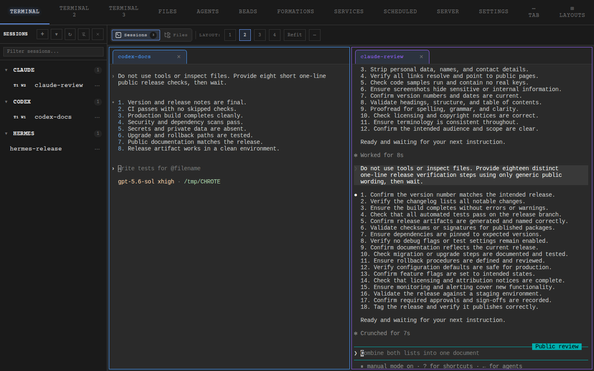
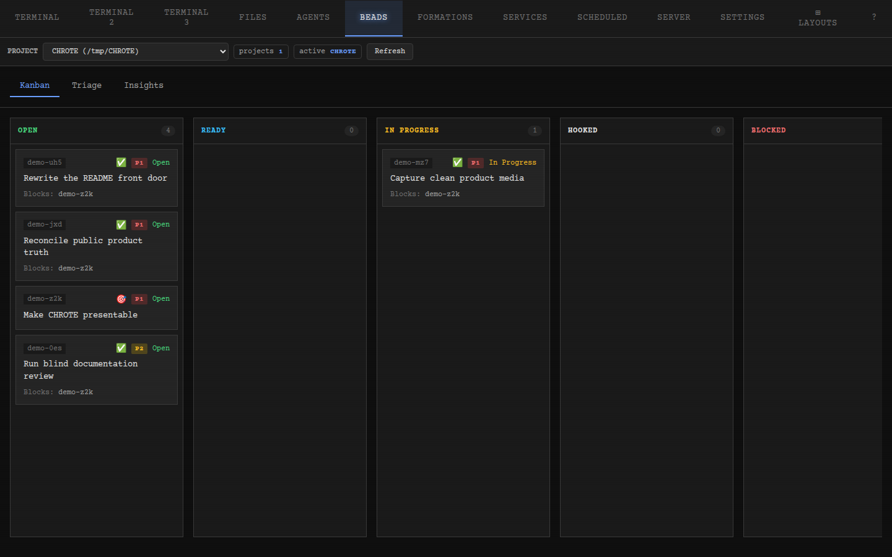

# CHROTE


**C**ontrol **H**ub for **R**emote **O**perations & **T**mux **E**xecution

> **WARNING:** CHROTE is for people who looked at one AI coding agent, thought
> "good start," opened five more terminals, lost track of which one was doing
> what, and decided the correct answer was obviously a browser cockpit.
>
> **CAUTION:** This is private infrastructure for a machine you own. It assumes
> you are comfortable with tmux, local services, weird agent output, and the
> occasional need to kill everything and start over.

CHROTE is a browser cockpit for durable, host-owned AI development work: the
place where one person runs a workforce of agents and trusts what they see.
Your terminal sessions, files, Beads, agents, workflows, and recovery state
live on the host. The browser is just glass.

Close the laptop. Change devices. Reconnect later. The work should still be
there, because a browser tab was never qualified to own it.

[](docs/assets/readme/attach-hermes-workflow.mp4)

<p align="center"><strong><a href="docs/assets/readme/attach-hermes-workflow.mp4">Watch the 18-second workflow</a></strong>: two attached agents, add a third window, attach Hermes.</p>

## Why this exists

One agent in one terminal is a workflow.

Five agents across tmux sessions, a Beads backlog, a file tree, recovery state,
and three half-finished builds is a control-room problem.

CHROTE is the control room. It does not replace the terminal, move durable state
into the browser, or pretend agent work is calm and linear. It gives the mess
handles — and then it goes further: it turns "one person plus N agents" from a
babysitting job into a supervised production line, where your attention is spent
only at decision points and quality gates.

This is not an *autonomous* software factory. It is a *supervised* one. The
difference is the whole product.

## Running work through Formations

Formations is how delegated work actually gets done here. In business terms:

1. **Delegate by describing.** You tell an agent the outcome you want; it
   authors the workflow — plan, execute, check, deliver — onto a spatial board
   through the Archon CLI. You read and adjust; you never assemble pipelines by
   hand.
2. **Quality is built into delivery.** Every workflow runs through gates:
   machine checks (lint, tests) and judgment checks (agent review, your
   verdict). Work loops until it passes. Nothing reaches you as "done" that did
   not earn it.
3. **One glance tells you the truth.** The board shows what every agent is
   doing now, what finished, what is stuck — and it is honest: everything shown
   is backed by durable run evidence, never by optimism. If the system does not
   know, it says so, plainly, instead of guessing.
4. **Your attention is spent deliberately.** Runs go unattended until a
   genuinely human decision appears — approve this default, judge these
   candidates, answer this question. Then one clear ask surfaces with the
   answer controls on it, and it reaches you even when you are not watching the
   board.
5. **Every claim is inspectable.** Open any step: what was attempted, what came
   out, why the gate passed or failed, the actual deliverable readable inline.
   Trust comes from being able to look, not from being told.
6. **You can always grab the wheel.** Any live agent session can be jumped
   into — take the keyboard, steer, hand back. Supervision is interactive, not
   a spectator view.
7. **It survives reality.** Crashes, restarts, disconnects — runs recover, and
   state says exactly what happened. That is what makes multi-day unattended
   operation safe rather than reckless.
8. **Output is a real deliverable.** A run ends in something you ship — a
   merged change, a post, a document — with provenance: which run produced it
   and which gates it passed. Actually shipping it stays your call.

The specs behind this live in [FORMATIONS.md](FORMATIONS.md) (the run model),
[ARCHON.md](ARCHON.md) (the CLI agents author with), and
[DATA-MODEL.md](DATA-MODEL.md) (persistence and event formats).

## What is on `main`

| Surface | Operator job |
| --- | --- |
| **Formations** | Author, run, and supervise gated agent workflows on a spatial board with honest run state |
| **Terminal 1-3** | Three independent workspaces, each with one to four windows attached to real tmux sessions |
| **Sessions / Files sidecar** | Find, Peek, attach, navigate, and inspect files without leaving the active terminal workspace |
| **Files** | Browse, inspect, edit, compare, and send configured workspace files to a session |
| **Beads** | Inspect configured `bd` workspaces, issues, ready work, triage, and health |
| **Agents** | Observe agent-like tmux sessions without requiring one blessed harness |
| **Recovery** | Distinguish live, offline, recoverable, and unmanaged work through Session Bank and typed recovery plans |
| **Scheduled / Server** | Inspect scheduled tasks, health, resources, runtime events, and bounded history |
| **Services** | Host optional server-side adapters without putting private tokens in the browser |

The terminal remains the heart of the thing. tmux owns process lifetime; CHROTE
owns the browser view and explicit operator actions. Formations borrows
the same session pool the terminals use — a judge with prior context is a
feature, and a busy session says so loudly instead of being silently stolen.

A few interaction rules are deliberate:

- Session-row clicks mean **Peek**. They do not silently reassign a window.
- The location chip navigates to an already attached session.
- The Sessions/Files sidecar is closed by default and takes zero width while
  closed. Pinning and width persist per terminal workspace.
- At `768px` and below, the sidecar overlays the terminals instead of crushing
  them.
- Browser disconnects must not kill tmux work.

Empty terminal windows have guardians. They do not execute code or solve race
conditions. They sit there judging the empty pane until you attach something.
Some things are load-bearing.

## Beads without leaving the cockpit

Agents can ramble. Beads are supposed to say what the work actually is.

CHROTE reads configured `bd` workspaces and surfaces issue state, ready work,
triage, dependencies, and project health. `bd` remains the source of truth;
CHROTE does not invent a second issue database.



## Who this is for

**This is probably for you if:**

- you already run agent CLIs in tmux;
- closing a laptop should not kill the work;
- you want terminals, files, Beads, workflows, recovery, and local services in
  one private browser surface;
- you think agents need supervision, not mythology;
- you want your own cockpit, not somebody else's control plane.

**This is not for you if:**

- you want a hosted multi-tenant SaaS product;
- you expect built-in accounts, password resets, and public-internet hardening;
- you want the browser to become the workspace source of truth;
- you need an OS sandbox around terminal agents;
- you have never used tmux and have no interest in starting.

## Quick start

The supported public path is a same-user Linux or WSL user service built from an
inspectable checkout.

Requirements: Linux or WSL with user systemd, Go 1.26.5+, Node.js 20.19+ or 22.12+,
npm, tmux, curl, and Git.

```bash
git clone https://github.com/Perttulands/CHROTE.git
cd CHROTE
./install.sh --workspace "$HOME/work"
```

Open <http://127.0.0.1:8094>.

The installer builds the dashboard and embedded Go binary from the checkout,
installs a user service, starts it, and checks `/api/health`. It does not require
`sudo`. Giving CHROTE all of `$HOME` is possible, but a narrower workspace is the
better default.

Read [the installation guide](docs/installation.md) before changing ports,
prefixes, service configuration, or remote access. Use
[troubleshooting](docs/troubleshooting.md) when a supported install is not
healthy.

## Trust boundary

CHROTE has **no built-in application login**. Anyone who can reach it is inside
the trusted operator boundary and can reach terminal-grade capabilities.

The sane deployment shape is:

```text
browser
  |
private network / HTTPS
  |
loopback CHROTE server
  |
  +-- tmux + ttyd
  +-- configured file roots
  +-- configured Beads workspaces
  +-- optional local adapters
```

Keep CHROTE bound to loopback. Put remote access behind an
operator-controlled private network such as Tailscale. Do not expose it directly
to the public internet. CORS is not authentication, and configured file roots do
not sandbox commands running in tmux.

Read [SECURITY.md](SECURITY.md) before treating this as anything less powerful
than remote shell access.

## Release status

CHROTE v2 is alpha.

- Latest tagged alpha: `v2.0.0-alpha.1`
- Current `main` development version: `2.0.0-alpha.2-dev`
- Legacy v1: preserved for archaeology, not supported

This README describes current `main`. A development version is not a published
release, and an older downloadable binary is not equivalent to current source.

## Architecture

CHROTE is a Go server with an embedded React dashboard. The dashboard is built,
copied into the Go tree, and baked into the server binary with `go:embed`. One
process serves the UI, API, recovery state, workflow runs, and loopback terminal
proxy.

The hard state stays boring and inspectable:

- tmux sessions for terminal work whose lifetime is independent of the browser;
- files under configured roots;
- `bd` workspaces for issue state;
- append-only run ledgers for workflow evidence;
- host-owned configuration and recovery records;
- Git for source and history.

The browser is disposable. Host-owned state—not browser state—is authoritative.

## Documentation

| Need | Start here |
| --- | --- |
| Current product and roadmap boundary | [PRD.md](PRD.md) |
| Install or upgrade | [docs/installation.md](docs/installation.md) |
| Troubleshoot | [docs/troubleshooting.md](docs/troubleshooting.md) |
| Security model | [SECURITY.md](SECURITY.md) |
| Contribute and reproduce CI | [CONTRIBUTING.md](CONTRIBUTING.md) |
| Component map | [COMPONENTS.md](COMPONENTS.md) |
| Release history | [CHANGELOG.md](CHANGELOG.md) |
| Documentation authority | [docs/source-truth-index.md](docs/source-truth-index.md) |

Plans and archives are context, not product authority. When docs disagree, the
[source-truth index](docs/source-truth-index.md) says which one wins.

## Development

```bash
npm ci --prefix dashboard
./scripts/build-embedded-dashboard.sh

cd src
go test ./...
go build ./cmd/server
```

See [CONTRIBUTING.md](CONTRIBUTING.md) for the full local and CI verification
contract. Do not build a release from stale embedded dashboard assets.

## License

MIT. Open source for people who want their own cockpit, not somebody else's
control plane.
