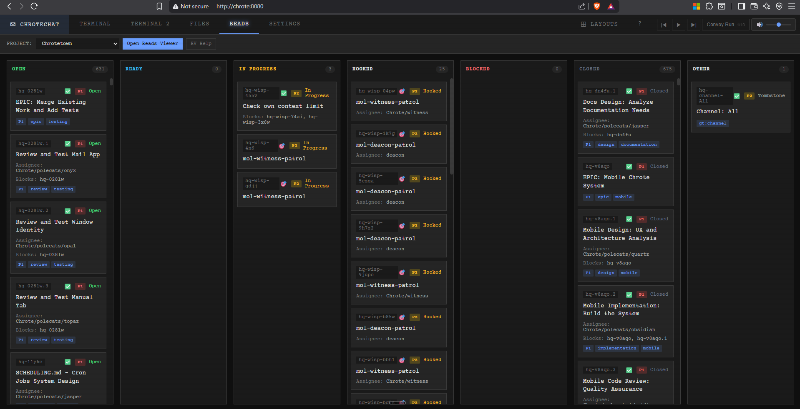
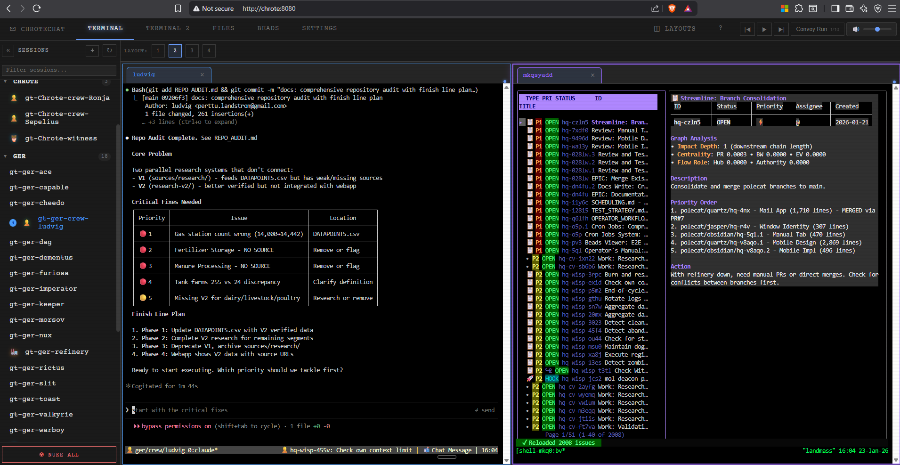
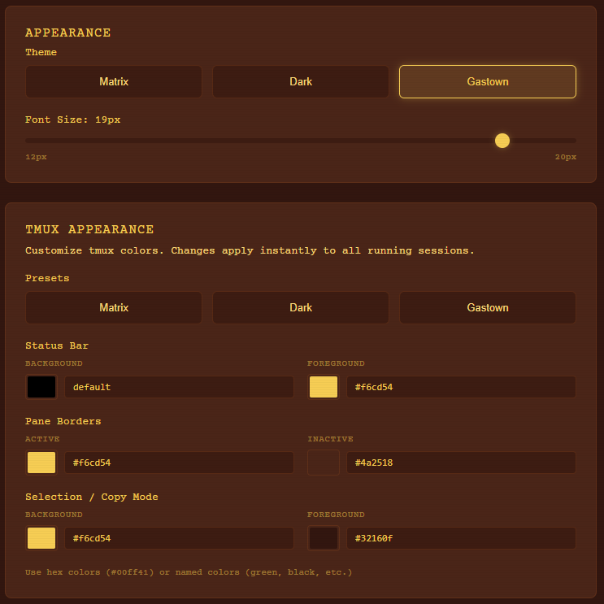
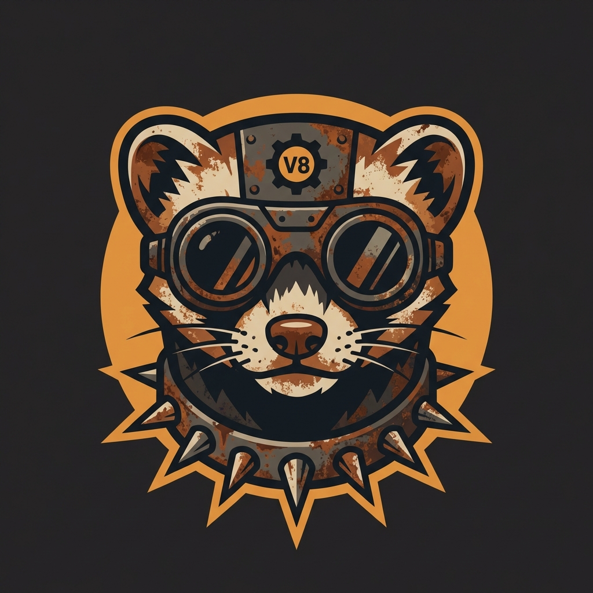
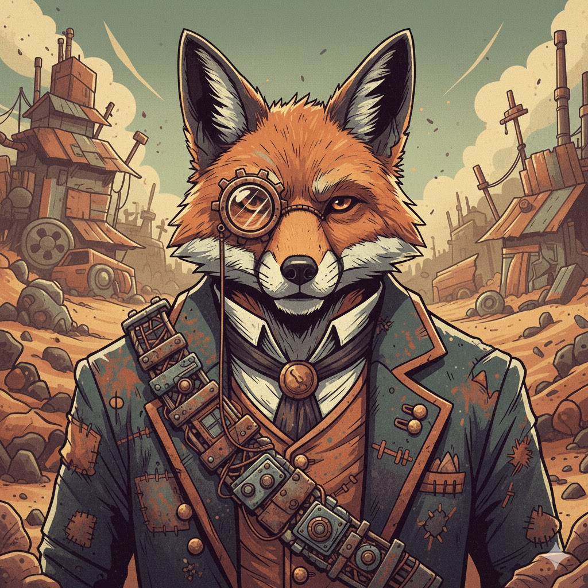
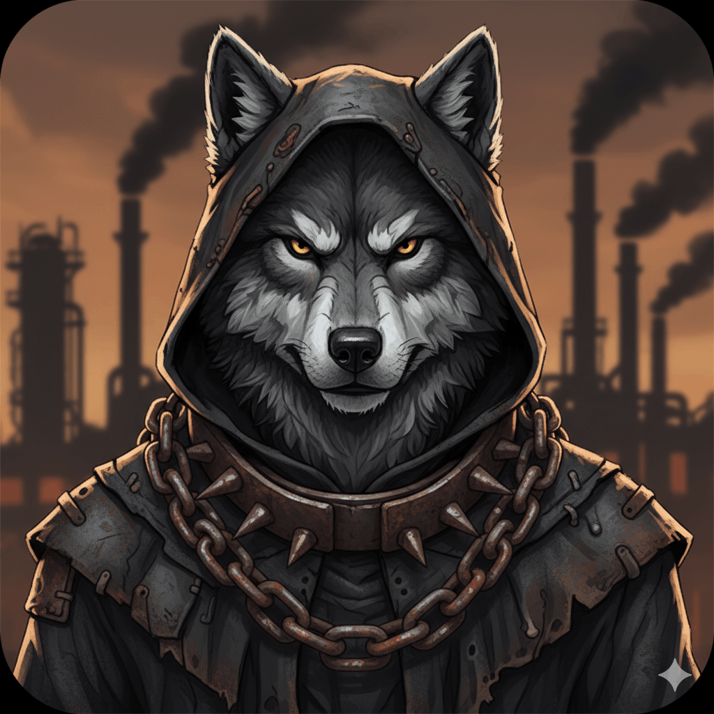
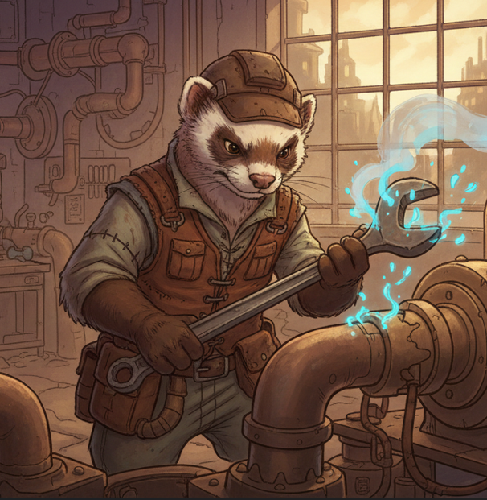
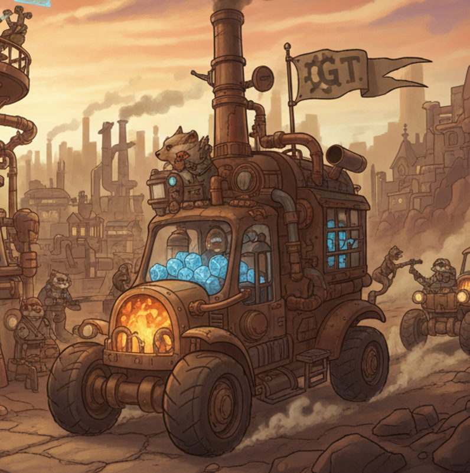
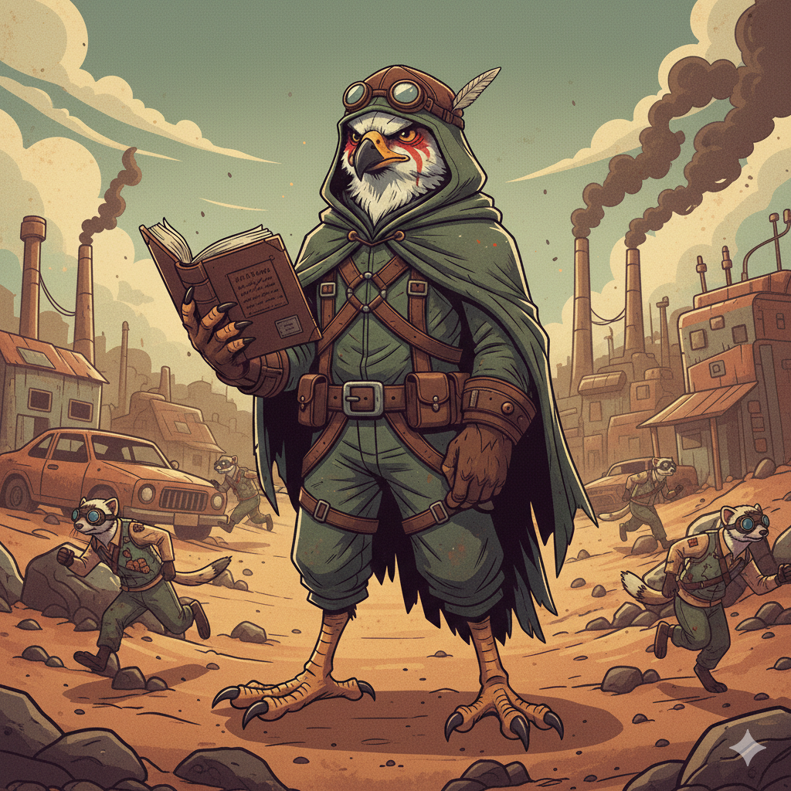
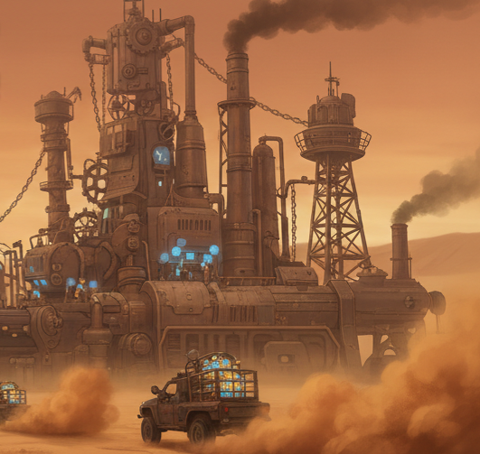

# CHROTE


**C**ontrol **H**ub for **R**emote **O**perations & **T**mux **E**xecution

---

> **WARNING:** CHROTE is for people who looked at one AI coding agent, thought
> "good start," opened five more terminals, lost track of which one was doing
> what, and decided the correct answer was obviously a browser cockpit.

> **CAUTION:** This is private infrastructure for a machine you own. It assumes
> you are comfortable with tmux, local services, broken builds, weird agent
> output, and the occasional need to kill everything and start over.

---

## What Is This?

CHROTE is a web cockpit for running a durable AI development workspace on your
own host.

The work lives on the host: tmux sessions, agent CLIs, source files, Beads,
local services, logs, builds, tests, and all the strange state that normally
dies when you close the wrong terminal tab.

CHROTE gives you a browser surface over that mess.

Open it from your laptop. Open it from your tablet. Open it from your phone
while pretending you are not checking whether an agent just rewrote the same
file three different ways.

The host keeps running. The sessions stay alive. The browser is just glass.

Client devices are disposable viewports.


---

## The Pitch

Terminal-first AI work is powerful. It also gets stupid fast.

One agent in one terminal is a workflow.

Five agents across tmux panes, a Beads backlog, a local context service, a TTS
queue, a file tree, and three half-finished builds is no longer a workflow. It
is a control-room problem.

CHROTE is the control room.

It does not replace the terminal. It stops the terminal from being trapped on
one screen, one laptop, one fragile browser tab, or one half-remembered tmux
command.

It gives you handles:

- the terminal that kept running
- the agent session you need to inspect
- the Bead that says what the work actually is
- the file tree where the state lives
- the local service that should stay local
- the big red button for when the session pile has become performance art

This is not magic. It is not an autonomous software factory. It is not a chat
app wearing a trench coat.

It is a cockpit for the host where the work actually lives.

---

## Who Is This For?

**This is not for you if:**

- you have never used tmux and do not want to learn
- you expect a polished SaaS product with account recovery emails
- you want AI coding to feel calm, linear, and supervised by adults
- you need the browser to own the work
- you think "works on my machine" is a warning instead of a lifestyle

**This is for you if:**

- you already run agent CLIs in terminal sessions
- you close laptops but do not want the work to die
- you want one browser view over terminals, files, Beads, and local services
- you accept that agents need supervision, not mythology
- you want your own cockpit, not someone else's control plane

---

## Dashboard Views

| View | What It Does |
| --- | --- |
| **Terminal** | Browser panes attached to durable tmux sessions |
| **Terminal 2** | A second independent terminal workspace |
| **Files** | File browsing for configured workspace roots |
| **Beads** | Modern `bd` issues, ready work, triage, and project state |
| **Agents** | Visibility into persona cards and agent-like tmux sessions |
| **Formations** | Spatial mission/formation/gate cockpit backed by Archon/Formations files |
| **Services** | Operator panels for selected local services |
| **Settings** | Theme, font, terminal, and session behavior |
| **Help** | Dashboard usage notes |

### Terminal View

The terminal is still the heart of the thing.

CHROTE does not try to hide tmux behind a toy abstraction. It gives you browser
panes that attach to real sessions. If a browser disconnects, the session keeps
running. If your laptop sleeps, the host does not care. If an agent is still
typing when you reconnect, you can watch the smoke in real time.

You can run one pane when you are focused, four panes when you are supervising,
and a second terminal workspace when the first one has become a crime scene.

Empty terminal windows show guardians. They do not execute code. They do not
solve race conditions. They just sit there, judging the empty pane until you
drop a session onto it.

### Files

CHROTE can browse the workspace roots you explicitly allow.

It is not trying to become an IDE. It is trying to answer the practical question
you hit constantly while supervising agents: "What file did they just touch, and
how bad is it?"


### Beads

Modern `bd` is the source of truth for work.

CHROTE surfaces Beads so the cockpit can show more than terminal noise. Agents
can ramble. Beads are supposed to say what the work actually is.



`beads_viewer` (`bv`) is optional, but useful. CHROTE can run it as a tmux
sidecar when you want the graph-aware view without leaving the cockpit.



### Themes

The dashboard still has a little theater in it.

Matrix, Dark, and Gastown themes change the room without changing the job. The
terminal remains the terminal. The cockpit just gets to have an opinion.



### Nuke All

Sometimes the correct session management strategy is mercy.

CHROTE still has a Nuke All flow. It is deliberately hard to trigger: the
dashboard opens a confirmation modal, requires the word `NUKE`, and sends a
dashboard-only confirmation header to the server.

Use it when the session pile has gone sideways. Do not use it as a substitute
for thinking.

---

## The Crew

Every empty terminal window in CHROTE has a guardian.

They are not a feature checklist item. They are a warning label with a face:
this is a terminal cockpit, not a glass office suite. The guardians are there
for the three seconds before you bury them under tmux. They are the dashboard's
way of saying: yes, this is serious work; no, we are not going to pretend it is
sterile.

### Terminal 1 - The Veterans

<table>
<tr>
<td width="25%" align="center">
<br>
<b>POLECAT</b><br>
<i>The Mechanic</i><br>
V8 engine heart. Keeps the rigs running when everything is on fire.
</td>
<td width="25%" align="center">
<br>
<b>FOX</b><br>
<i>The Strategist</i><br>
Monocle and military precision. Plans the operations others execute.
</td>
<td width="25%" align="center">
<br>
<b>BADGER</b><br>
<i>The Engineer</i><br>
Welding goggles and steady hands. Builds what Fox designs.
</td>
<td width="25%" align="center">
<br>
<b>WOLF</b><br>
<i>The Enforcer</i><br>
Hooded and chained. When sessions need ending, Wolf answers.
</td>
</tr>
</table>

### Terminal 2 - The Operations

<table>
<tr>
<td width="25%" align="center">
<br>
<b>CREW</b><br>
<i>The Technician</i><br>
Wrench in hand, plasma flowing. Keeps the terminals alive.
</td>
<td width="25%" align="center">
<br>
<b>CONVOY</b><br>
<i>The Transport</i><br>
The rig itself. Carries your workloads across the wasteland.
</td>
<td width="25%" align="center">
<br>
<b>HAWK</b><br>
<i>The Architect</i><br>
Cloaked scholar. Reads the ancient docs. Guides the workers.
</td>
<td width="25%" align="center">
<br>
<b>TOWN</b><br>
<i>The Settlement</i><br>
CHROTE itself. The glowing hub where all roads lead.
</td>
</tr>
</table>

---

## Agents

The Agents view is deliberately boring in the best way: it watches tmux sessions
whose names look like agent sessions.

By default, that means prefixes like:

```text
agent-*
claude-*
codex*
gemini-*
hermes-*
opencode*
```

Override the prefixes when your workspace uses different names:

```bash
CHROTE_AGENT_PREFIXES=claude-,codex,opencode,agent-
```

The view infers simple state from recent terminal output, shows context
percentage when visible in scrollback, and extracts Beads IDs such as
`home-fv6.9`.

It does not currently run an agent society. It does not own agent-to-agent IPC.
It does not pretend terminal scrollback is a perfect audit log.

It gives the operator a map.

---

## Services

The Services view is where CHROTE starts to become more than terminals.

Some host-owned capabilities should stay local: text-to-speech queues, context
stores, model tools, browser automation, maybe later an orchestration sidecar
that has earned its place. CHROTE can expose selected controls for those
services without making the browser talk to raw private ports or hold private
tokens.

Current service adapters:

| Service | Default URL | CHROTE Role |
| --- | --- | --- |
| TTS Gateway | `http://127.0.0.1:3100` | Inspect health, queue, voices, playback, and enqueue spoken responses |
| Context Citadel | `http://127.0.0.1:3200` | Read, edit, save, inspect history, and ask grounded questions over context docs |

Browser clients call CHROTE routes under `/api/services/...`. CHROTE talks to
the upstream services server-side and injects credentials where needed.

Tokens stay on the host. The browser does not get them.

---

## Version Line

CHROTE v2 is the current line.

It continues the original CHROTE project, but it is not a compatibility patch to
v1. The shape changed. The job changed. The README gets to be honest about that.

Current release status: v2 is alpha. The cockpit is usable, but the API, install
surface, and service panels are still moving.

The original code line is preserved for archaeology:

- branch: `legacy/v1`
- release: `v1.0.0`

v2 is the line on `main`.

### What Changed In v2?

The old CHROTE was built around a very specific era: Gastown, ChroteChat,
agent swarms, terminal chaos, mobile command center energy, and a heroic amount
of duct tape.

That era taught us useful things.

It also left dents.

v2 keeps the parts that earned their keep:

- durable tmux sessions
- browser terminal panes
- workspace file browsing
- Beads-backed work state
- agent session visibility
- local services behind server-side adapters
- secrets that stay on the host, where they belong
- the guardians, because some things are load-bearing

v2 drops the parts that became dead weight.

ChroteChat is gone. The cockpit is not chat.

Gastown is no longer the center of the universe. Gastown, Gas City, Codex,
Claude Code, OpenCode, Gemini, Hermes, Beads, `bv`, and plain old tmux can all
matter. None of them gets to own CHROTE.

CHROTE belongs to the workspace.

---

## Architecture

The short version:

```text
browser
  |
  v
CHROTE server
  |
  +-- tmux socket + ttyd terminal bridge
  +-- configured filesystem roots
  +-- bd / beads workspaces
  +-- optional bv tmux sidecar
  +-- selected localhost service adapters
```

The longer version: CHROTE is a Go server with an embedded React dashboard. The
dashboard is built first, copied into the Go tree, and baked into the server
binary with `go:embed`.

One process serves the dashboard and the API.

The host owns the hard state. CHROTE is the cockpit.

---

## Access

Current local `/srv` proving service:

```text
http://127.0.0.1:8095/
```

Legacy rollback user service:

```text
http://127.0.0.1:8094/
```

Tailnet URL format:

```text
http[s]://<tailnet-host>:<tailnet-port>/
```

The expected deployment is private: localhost and a private access layer such as
Tailscale. CHROTE has no built-in application login or access token: host and
tailnet access controls are the trust boundary. Do not expose CHROTE directly to
the public internet. CORS is not an authorization or CSRF boundary; treat every
browser origin and client with network reachability as trusted.

Older deployments may still define `API_AUTH_TOKEN`. CHROTE ignores that removed
setting and logs a startup warning without printing its value.

Common service commands:

```bash
# /srv proving lane
systemctl status chrote-srv.service --no-pager
journalctl -u chrote-srv.service -f

# legacy rollback lane
systemctl --user status chrote.service
systemctl --user restart chrote.service
journalctl --user -u chrote.service -f
```

---

## Runtime

CHROTE currently runs side-by-side in two service lanes during the `/srv`
migration.

```text
/srv proving lane:
  source: /srv/chrote
  data: /srv/data/chrote
  unit: chrote-srv.service
  CHROTE HTTP: 127.0.0.1:8095
  terminal ttyd: 127.0.0.1:7686

legacy rollback lane:
  source: /home/perttu/chrote
  unit: chrote.service
  CHROTE HTTP: 127.0.0.1:8094
  terminal ttyd: 127.0.0.1:7683
```

The terminal proxy is loopback-only. A private access layer should expose only
the CHROTE HTTP server.

The `/srv` proving lane reads tmux socket mappings from its private runtime
environment. The Perttu legacy rollback lane uses this interactive tmux socket:

```bash
TMUX_TMPDIR=/run/user/1000/chrote-tmux tmux ls
```

Baseline session:

```bash
TMUX_TMPDIR=/run/user/1000/chrote-tmux tmux new-session -A -s main -c "$HOME"
```

---

## Configuration

Important runtime variables:

```bash
CHROTE_WORKDIR=<workspace-root>
CHROTE_ROOTS=<workspace-root>
CHROTE_WRITE_ROOTS=<comma-separated mutation roots>
CHROTE_FILE_DENY_PATHS=<extra comma-separated sensitive roots>
CHROTE_MAX_UPLOAD_BYTES=67108864
CHROTE_BEADS_WORKSPACES=<workspace-root>
CHROTE_BD_COMMAND=bd
CHROTE_AGENT_PREFIXES=claude-,codex,opencode,agent-
CHROTE_TTS_URL=http://127.0.0.1:3100
CHROTE_CONTEXT_API_URL=http://127.0.0.1:3200
CHROTE_MANAGED_RECOVERY_STATUS_PATH=/srv/data/chrote/tmux-recovery/managed-status.json
```

Private service adapter values live outside the repo:

```text
/srv/chrote/config/chrote.env
/etc/chrote/chrote-srv.env
~/.config/chrote/services.env   # legacy rollback lane
```

That is where private service-adapter credentials belong. Do not commit them or
paste them into issues. Do not teach the browser your secrets.

Externally managed recovery status is a separate read-only registry, not
Session Bank or Persistent desired state. Owner-side restore can atomically
publish it with `scripts/tmux-recovery/restore.py --managed-status-output ...`;
the file is mode `0600` and must not contain descriptors, argv, env, tokens, or
restart instructions. CHROTE reads it only as a regular, non-symlink,
owner-only file; it does not require the writer UID to match the service UID, so
the configured file path and parent directory permissions are the trust boundary.

---

## Build

```bash
cd /path/to/chrote/dashboard
npm run build

cd /path/to/chrote
rm -rf src/internal/dashboard/dist
cp -r dashboard/dist src/internal/dashboard/dist

cd /path/to/chrote/src
go test ./...
go build -o ../chrote-server ./cmd/server

# Restart only the intended lane.
systemctl restart chrote-srv.service        # /srv proving lane
systemctl --user restart chrote.service     # legacy rollback lane
```

For more installation detail, see [docs/installation.md](docs/installation.md).

---

## Security Model

CHROTE is private infrastructure.

The sane shape is:

- bind CHROTE and upstream services to localhost
- expose only CHROTE through a private tailnet/network layer
- treat host and tailnet access controls as the trust boundary; CHROTE has no application login
- keep broad read access separate from narrower file mutation roots
- keep service credentials server-side
- treat browser clients as viewports, not secret owners

CHROTE is reckless enough to be useful. It should not be reckless with your
tokens.

See [SECURITY.md](SECURITY.md) for the security model.

---

## Roadmap

The current line is the durable cockpit:

- terminals
- files
- Beads
- agent session visibility
- selected local services

The next serious direction is a meta-harness: explicit adapters, run ledgers,
recipes, teams, transcripts, and human approval boundaries across multiple
agent products and local tools.

Gas City may become a sidecar. Gastown ideas may come back as adapters. Other
harnesses may earn first-class treatment.

Nothing gets to own the center for free.

The center is the workspace.

---

## See Also

| Document | What It Is |
| --- | --- |
| [docs/source-truth-index.md](docs/source-truth-index.md) | Active/supporting/archive doc hierarchy and enforcement boundary |
| [PRD.md](PRD.md) | Current product requirements and staged roadmap |
| [docs/installation.md](docs/installation.md) | Generic install and rebuild notes |
| [docs/legacy-ideas.md](docs/legacy-ideas.md) | Useful ideas from the old line, demoted on purpose |
| [SECURITY.md](SECURITY.md) | Security model |
| [CHANGELOG.md](CHANGELOG.md) | Release notes |

---

## License

MIT. Open source for people who want their own cockpit, not someone else's
control plane.
