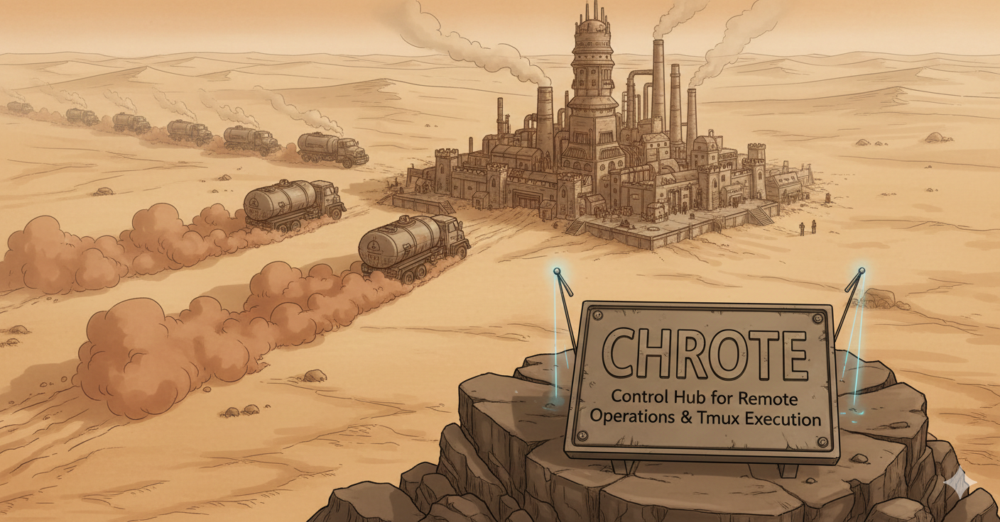

# CHROTE



Control Hub for Remote Operations and Tmux Execution.

CHROTE is a browser-based agentic IDE for one operator on one host. It shows
the tmux sessions running on that host, arranges them into windows you can
watch side by side, and lets you type into any of them from a laptop, tablet,
or phone on your own private network.

tmux still owns the sessions. CHROTE is the way in.

## Why it exists

One agent in one terminal needs no dashboard. Ten agents across a dozen tmux
sessions is a different problem. You lose track of which one is waiting on an
answer, which one exited an hour ago, and which one has been rewriting the same
file since lunch. SSH and tmux handle that fine at a desk. They handle it badly
from a phone.

CHROTE puts handles on the work without taking it over. Close the browser,
switch devices, restart the server, and the sessions keep running, because the
browser never owned them. CHROTE also will not restart a process that died or
rebuild your work after a reboot. Those jobs belong to tmux, to your shell, or
to a systemd unit you wrote on purpose.

Any CLI program can run in a CHROTE window, because a window is a tmux session
running your shell. Codex, Claude Code, a build, a log tail, `psql`. CHROTE does
not know which is which and does not need to.

## The terminal workspace

Terminals are the product. Everything else is here because it saves a trip back
to the terminal.

- A terminal tab is an independent workspace. Three by default, one to six in
  Settings.
- Each tab shows one to four windows at a time.
- One window can hold several tmux sessions and display one of them. You cycle
  through the rest without losing the binding.
- The Sessions sidecar lists the sessions on every tmux socket CHROTE is
  configured to read. Attach one to a window from its row menu, or create a new
  session straight into an empty window.
- Clicking a session row opens a floating preview called Peek. It never
  reassigns your window. Losing a layout to a stray click is worse than one
  extra click.
- A location chip on an attached session jumps to the window already showing it.
- Showing a session displaces nobody. A second device, or a second person, sees
  it live alongside you. tmux draws a window once, so everyone watching sees the
  size one of you set; `Claim` makes it fit the device you are on, and the
  others keep watching at that size.
- A binding is yours until you remove it. If the session ends, or another client
  detaches your terminal, the tile keeps its last output and offers the next
  move.
- The Files sidecar opens beside the terminal. Its state belongs to that tab.
- Both sidecars start closed and reserve no width while closed.
- You can save ten layout presets and load one back later.

On a viewport narrower than 768 pixels the tab bar collapses into a menu and
the terminal area shows one window at a time. A phone is good for reading
output and answering a prompt. Arranging a four-window layout wants a real
screen.

## What is in the build

| View | What it does |
| --- | --- |
| Terminal 1 to N | Attach, arrange, and type into tmux sessions |
| Files | Browse, read, edit, compare, and send files under the configured roots to a session |
| Server | Health, resource readings, runtime events, and a bounded history |
| Settings | Appearance, tmux colors, session defaults, tab count, launch users, cleanup |
| Beads | Issues, ready work, triage, dependency graph, insights, and comments from configured `bd` workspaces |
| Scheduled | Host-owned tasks that deliver a prompt to a named tmux session on a schedule |
| Services | Local adapters called through CHROTE routes, so their tokens stay on the server |

Terminal, Files, Server, and Settings are the core. Beads, Scheduled, and
Services are first-party components built on that core. Each one degrades alone
when `bd` is missing or an adapter is down, and none of them can stop the core
from loading.

A scheduled task sends its prompt into tmux verbatim. The receipt says CHROTE
delivered the keystrokes. It does not claim the program on the other end read
them.

Formations should eventually compose agents and gates into a mission. None of it
ships in this build. That work lives in
[chrote-agent-formations](https://github.com/Perttulands/chrote-agent-formations).
Treat it as an intention, not something you can install today.

## Where state lives

CHROTE reads and controls the real thing instead of keeping its own copy.

- tmux owns sessions and the processes inside them.
- The filesystem owns files. `CHROTE_ROOTS` bounds which paths the file API
  will touch.
- `bd` owns issues.
- Host configuration owns scheduled tasks and service adapters, under your XDG
  config and state directories.
- The browser owns the parts nobody else needs. Window layout, tab labels,
  presets, theme, and feature flags live in `localStorage`.

Clear your browser storage and you lose an arrangement, not any work.

## Access and trust

CHROTE has no login, and the current design does not add one. Anyone who can
open it gets a terminal as the account CHROTE runs under. The network is the
boundary.

The server binds `127.0.0.1:8094` by default. To reach it from another device, put it behind a private
network with HTTPS, such as Tailscale Serve. CORS is not authentication.

`CHROTE_ROOTS` limits the file API. It does not sandbox anything an agent runs
inside tmux. Read [SECURITY.md](SECURITY.md) before you expose this anywhere.

## Install

You need Linux or WSL with user systemd, Go 1.26.6 or newer, Node.js 20.19+ or
22.12+, npm, tmux, curl, and Git.

```bash
git clone https://github.com/Perttulands/CHROTE.git
cd CHROTE
./install.sh
```

Then open <http://127.0.0.1:8094>.

The installer builds the dashboard and the Go binary from your checkout,
installs them under `$HOME/.local`, writes a `chrote.service` user unit, starts
it, and checks `/api/health`. It never calls `sudo`. Use `--workspace PATH` to
narrow the file root from `$HOME`, or `--port` to move the port.

[docs/installation.md](docs/installation.md) covers upgrades, optional
integrations, and remote access. [docs/troubleshooting.md](docs/troubleshooting.md)
covers an install that comes up unhealthy.

## Architecture

One Go process serves everything. It embeds the built React dashboard, exposes
the JSON API under `/api/`, runs the scheduler, calls optional adapters, and
serves `/terminal/` as a WebSocket of its own. It runs the tmux attach for one
named session on one configured tmux socket on a pseudo-terminal it allocates,
and relays that pseudo-terminal to the browser. If the session is not on that
socket, the attach fails instead of falling back to another tmux server.

- `dashboard/src/` is the React UI.
- `src/cmd/server/` wires the process together.
- `src/internal/api/` holds the tmux, files, beads, scheduled, services, health,
  and system handlers.
- `src/internal/proxy/` owns the terminal transport and its pseudo-terminals.
- `src/internal/dashboard/` embeds the built dashboard into the binary.
- `scripts/` holds the build, contract, and install entrypoints.

## Development

```bash
npm ci --prefix dashboard
./scripts/build-embedded-dashboard.sh
cd src
go test ./...
go build ./cmd/server
```

The dashboard is embedded in the binary, so build it with
`scripts/build-embedded-dashboard.sh` and verify the result with
`python3 scripts/check-embedded-dashboard.py`. Do not copy build output by hand.
[CONTRIBUTING.md](CONTRIBUTING.md) lists every gate CI runs.

## Where to read next

| Need | Read |
| --- | --- |
| Why CHROTE exists | [VISION.md](VISION.md) |
| Product contract and non-goals | [PRD.md](PRD.md) |
| System ownership and runtime shape | [ARCHITECTURE.md](ARCHITECTURE.md) |
| Security and trust boundary | [SECURITY.md](SECURITY.md) |
| Install, upgrade, remote access | [docs/installation.md](docs/installation.md) |
| An install that is not healthy | [docs/troubleshooting.md](docs/troubleshooting.md) |
| Contribute and reproduce CI | [CONTRIBUTING.md](CONTRIBUTING.md) |
| Runtime component map | [COMPONENTS.md](COMPONENTS.md) |
| Which document wins on a conflict | [docs/source-truth-index.md](docs/source-truth-index.md) |

## Status

CHROTE v2 is alpha. `VERSION` holds the current number and
[CHANGELOG.md](CHANGELOG.md) records what changed.

## License

MIT. See [LICENSE](LICENSE).
